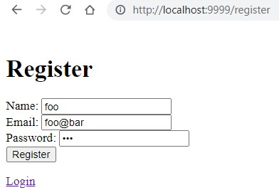
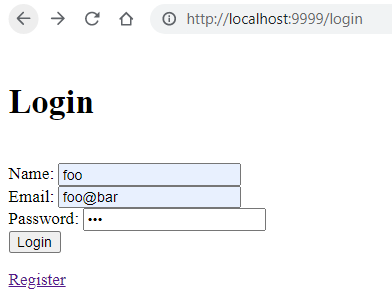
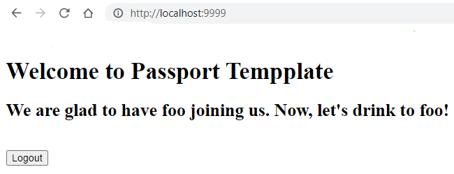
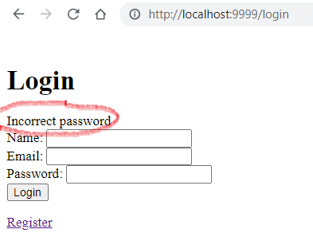

## Common Application Login

Almost every application requires the login as the entry point.  This node project provides the bare mininum implmementation of node-epress-passport employing local strategy.  

Passport is a compatible middleware for express that allows you to choose which authentication strategy to use.  Some of the common strategies are local, federated with Facebook and Google, OpenID, and OAuth providers.  Since this template only implements local strategy, further exploy of passport is encouraged.

The focus of this project is on middleware.  However, this is a good starting point for futher investment of your time in backend development (database integration, business logic and policy), or further improving the frontend.

Note, your .env file should contain the following defines:

```
PORT=####
NODE_ENV=development
SESSION_SECRET=your secret
```

<strong>Generate a strong session secret from *crypto*</strong>

`node -e "console.log(require('crypto').randomBytes(64).toString('hex'));"`

Copy the output to *.env* file.

<br>  

For more information on the makeup of the project, read file *package.json* and to find out how to start the application.  Currently, it is `npm run dev`.

Note also, this template requires further database implementation if you wish to save session data on the server side.  Currently, session data in runtime memmory is wiped out if you restarted the server.  As you can guess, memmory leakage in connect.session() is a concern and should not be used in production environment.


### Recommend further works

1. Use express-validator to validate contraints

2. Use cachable database to store session data

3. Add [express dynamic strategy](https://www.npmjs.com/package/dynamic-passport-strategies) to activate/deactivate during runtime and enable cluster support by spreading the configuration across the multiple nodejs instances.

### Getting Started

1. Clone this repository

2. Update local development environment 

    `npm install`

3. Run the app

    `npm run dev`

### Sample output

```
> nodeexpresslogintemplate@1.0.0 dev D:\DEVEL\NODEJS\BrainUnscramblers\NodeExpressLoginTemplate
> nodemon server.js

[nodemon] 2.0.18
[nodemon] to restart at any time, enter `rs`
[nodemon] watching path(s): *.*
[nodemon] watching extensions: js,mjs,json
[nodemon] starting `node server.js`
Server is running on port 9999
Registering for  [
  {
    id: '1657051407426',
    name: 'foo',
    email: 'foo@bar',
    password: '$2b$10$d58uZ3ol2G1uK14NMZeqdunMRjEBR27PaUHdrlQZkjQs.VDZBHPFK'
  }
]
```

<br>  

<strong>Snapshots</strong>







Logging out will take you back to the login page.  Now, try to login with an invalid password and notice the express-flash message cirled in red below.




<br>   

### Modules and dependencies

The followings modules are some essential components for implementing the usual application login.  It can be used as a template for those who wish to not start from scratch.  These module can be found listed in package.json file.  It is recommended that you should check with the NPM registry for throurough details on each named modules bellow.

* [express](https://www.npmjs.com/package/express) module is a light weight server that is fast, unopinionated, web framework for node.  Together with nodejs is made up the popular framework by which additional modules can be extended.

* [dotenv](https://www.npmjs.com/package/dotenv) module is used to store and retrieve secrets in .env file

* [ejs](https://www.npmjs.com/package/ejs) module is an embedded javascript template used to simplify express views.  Files create under views folder should be named *.ejs

* [express-flash](https://www.npmjs.com/package/express-flash) is an extension of connect-flash with the ability to define a flash message and render it without redirecting the request.  Implement in views/*.ejs files.

* [express-session](https://www.npmjs.com/package/express-session) is used to create session middleware in the cookie retaining just the session ID.  The full session object must be saved on the server side and compared with client session ID for authentication.

* [passport](https://www.npmjs.com/package/passport) is Express-compatible authentication middleware for nod.js.  Its sole purpose is to authenticate requests via an extensible set of plugins known as strategies. Passport does not mount routes or assume any particular database schema, which maximizes flexibility and allows application-level decisions to be made by the developer. The API is simple: you provide Passport a request to authenticate, and Passport provides hooks for controlling what occurs when authentication succeeds or fails.

* [passport-local](https://www.npmjs.com/package/passport-local) is one of the  strategies for authenticating with a username and password.  This module lets you authenticate using a username and password in your Node.js applications. By plugging into Passport, local authentication can be easily and unobtrusively integrated into any application or framework that supports Connect-style middleware, including Express.


### Build and Run Docker image

Generate a docker image so you can share development code on dockerhub.

<strong>Build</strong>

`docker build -t hurricanemark/nodejslogintemplate:1.0 .`

<strong>List the docker image</strong>

`docker image ls`

```
PS D:\DEVEL\NODEJS\BrainUnscramblers\NodeExpressLoginTemplate> docker image ls
REPOSITORY                            TAG                                        IMAGE ID       CREATED          SIZE
hurricanemark/nodejslogintemplate     1.0                                        f5eaaeef3571   43 seconds ago   961MB
```

<strong>Run docker</strong>

`docker run -p5432:8080 f5eaaeef3571`

```
PS D:\DEVEL\NODEJS\BrainUnscramblers\NodeExpressLoginTemplate> docker run -p 5432:8080 f5eaaeef3571                   

> nodeexpresslogintemplate@1.0.0 start /app
> node server.js

Warning: connect.session() MemoryStore is not
designed for a production environment, as it will leak
memory, and will not scale past a single process.
Server is running on port 8080
```

To access the running docker container, from the browser http://[your ip address]:5432